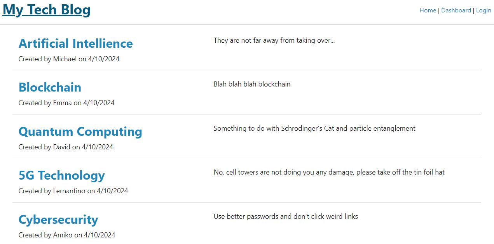
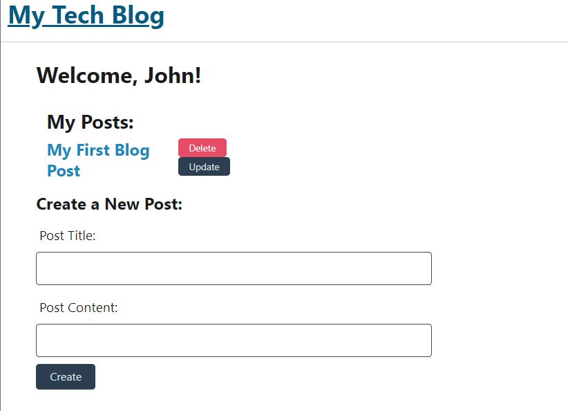

# My Tech Blog Project

## Description
This project entailed the creation of a full-stack web application in the form of a blog about tech-related topics.  Given that the application has a built-out back-end, this application allows for users to create accounts, log in, and create and comment on blog posts that will persist from session to session.

## Installation
No installation necessary, the application can be accessed at the following link: 
[Tech Blog Project](https://tech-blog-project.onrender.com/)

## Usage
Upon running the application, this is a screenshot of what the landing page will look like:

Before logging in, a user will be able to look at this page only.  To login, click the button in the top right of the screen.  You will be prompted to either provide an existing username and password or sign up with new credentials.  Once you have logged in or created an account, you will have access to the dashboard page where you can look at all of your posts or any specific post in particular.

The dashboard looks like this: 

If at any point the user would like to log out, they can simply click the log out button in the top right of the screen.  They will be logged out automatically if they remain idle on the page for too long.

## Contributing
N/A

## Tests
N/A

## Credits
The module 14 mini project is heavily referenced throughout the project

Additionally, I received a lot of help from Jaytee Padilla, a tutor through the bootcamp, who helped me tremendously in the debugging process of what I had already created.  